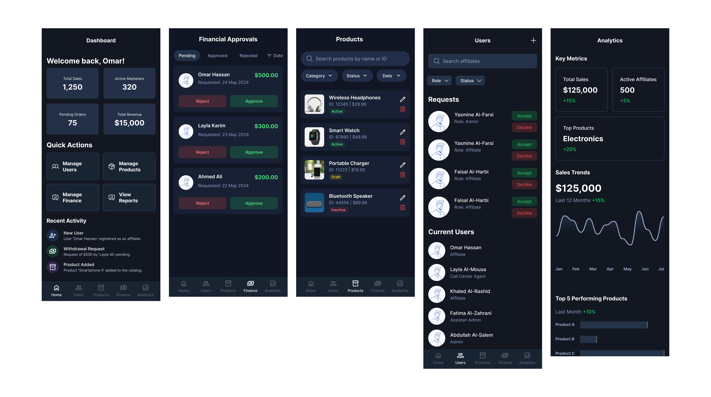

# Affiliate Marketing & Delivery Management System

   

## 📱 Project Overview
A comprehensive mobile application designed for a local mirror manufacturing company to streamline their affiliate marketing operations and delivery management. The system replaces manual processes with an automated, multi-role platform supporting both Arabic and English languages.

*Screenshots:*

***Admin Screens***


***Affiliate Screens***


### Key Capabilities
- **Multi-role architecture** with granular permissions
- **Automated commission management** with approval workflows
- **Delivery API integration** for seamless coordination
- **Bilingual interface** with cultural design considerations
- **In-app communication** for customer confirmation

## Team Members
- Back-end Developer 1: [Abdelrahime7](https://github.com/Abdelrahime7)
- Back-end Developer & UI/UX Designer: [Hocine-Bec](https://github.com/Hocine-Bec)
- Front-end Developer 3: [moonmido](https://github.com/moonmido)

## 💼 Business Context

**Client**: Local manufacturer specializing in mirrors and custom designs

**Challenge**: Manual processes for managing affiliate marketers, tracking orders, coordinating deliveries, and calculating commissions led to inefficiencies and errors.

**Solution**: Unified mobile platform automating the entire workflow from order submission through delivery completion and commission payout, with role-based access for all stakeholders.

### Before Implementation
- ❌ Manual order processing and tracking
- ❌ Paper-based commission calculations
- ❌ Disconnected delivery coordination
- ❌ Error-prone financial management

### After Implementation
- ✅ Automated workflow management
- ✅ No administrative headaches
- ✅ Integrated commission system with transparency
- ✅ Streamlined multi-party coordination


## 🛠️ Technology Stack

### Frontend
- **Framework**: React Native 0.72+
- **Language**: TypeScript
- **State Management**: Redux Toolkit
- **Navigation**: React Navigation
- **UI Components**: Custom RTL/LTR compatible library
- **Real-time**: SignalR client integration
- **Internationalization**: i18n with Arabic/English support

### Backend
- **Framework**: .NET Core 9.0
- **Database**: Entity Framework Core with PostgreSQL
- **Authentication**: JWT Bearer Tokens with role-based authorization
- **API Architecture**: RESTful Web API
- **External Integration**: HTTP client for delivery API

### Design & Development Tools
- **Design**: Figma (component library and prototypes)
- **Development**: Android Studio, Visual Studio 
- **Version Control**: Git
- **API Testing**: Postman


## 👥 User Roles & Permissions

<table>
<thead>
<tr>
<th>Role</th>
<th>Access Level</th>
<th>Key Responsibilities</th>
<th>Restrictions</th>
</tr>
</thead>
<tbody>
<tr>
<td><strong>👑 Admin</strong></td>
<td>Full System</td>
<td>
• Product catalog management (CRUD)<br>
• Commission structure setup (fixed per product)<br>
• User management (all roles)<br>
• Withdrawal approval<br>
• System analytics & reporting<br>
• Delivery API configuration
</td>
<td>None</td>
</tr>
<tr>
<td><strong>🛠️ Assistant Admin</strong></td>
<td>Order Review</td>
<td>
• Review order queue<br>
• Approve/reject order submissions<br>
• View order details<br>
• Monitor personal activity log
</td>
<td>
❌ Cannot modify commissions<br>
❌ Cannot access system settings<br>
❌ Cannot manage users
</td>
</tr>
<tr>
<td><strong>📢 Affiliate</strong></td>
<td>Marketing & Tracking</td>
<td>
• Create and submit orders<br>
• Real-time order tracking<br>
• Commission monitoring (total/pending/confirmed)<br>
• Withdrawal requests (cash or postal)<br>
• Performance analytics<br>
• Receive push notifications
</td>
<td>
❌ Cannot approve orders<br>
❌ Cannot modify products<br>
❌ Cannot view other affiliates' data
</td>
</tr>
<tr>
<td><strong>🚚 Delivery Office</strong></td>
<td>API Integration</td>
<td>
• Automatic order receipt via API<br>
• Driver assignment<br>
• Status synchronization with AM-System
</td>
<td>External system integration</td>
</tr>
<tr>
<td><strong>👨‍✈️ Driver</strong></td>
<td>Delivery Management</td>
<td>
• View assigned orders only<br>
• Update delivery status<br>
• Route optimization<br>
• Delivery confirmation
</td>
<td>
❌ Cannot see unassigned orders<br>
❌ Cannot modify order details
</td>
</tr>
<tr>
<td><strong>📞 Call Center Agent</strong></td>
<td>Customer Communication</td>
<td>
• In-app customer calling<br>
• Order confirmation workflow<br>
• Status updates (Confirmed/Rejected/No Response)
</td>
<td>
❌ Limited to assigned orders<br>
❌ Cannot modify products or commissions
</td>
</tr>
</tbody>
</table>


## 🌟 Core Features

### 📦 Product Management (Admin)
- Complete CRUD operations for product catalog
- Set fixed commission amounts per product
- Manage inventory levels
- Product categorization and search
- Image upload and management

### 📝 Order Management
**For Affiliates:**
- Intuitive order creation form
- Customer information capture
- Product selection with commission preview
- Order history with filtering

**For Assistant Admin:**
- Order review queue with priority sorting
- Approve/reject workflow with notes
- Bulk order operations

**For All Roles:**
- Real-time status tracking with timeline view
- Push notifications for status changes
- Order details with complete audit trail

### 💰 Commission System
**Calculation Rules:**
- Fixed commission per product (set by Admin)
- Commission earned only on successful delivery
- Automatic calculation upon delivery confirmation

**Commission States:**
- **Pending**: Order delivered, awaiting verification
- **Confirmed**: Verified and ready for withdrawal
- **Paid**: Withdrawn by affiliate

**Withdrawal Process:**
1. Affiliate submits withdrawal request
2. Admin reviews and approves
3. Payment processed via selected method (Cash/Postal)
4. Transaction recorded in history

### 📊 Analytics & Reporting
**Affiliate Dashboard:**
- Total earnings overview
- Commission breakdown (pending/confirmed/paid)
- Top-selling products
- Order success rate
- Performance trends

**Admin Dashboard:**
- System-wide metrics
- Per-affiliate performance
- Product popularity analysis
- Commission summaries
- Financial forecasting
- Export functionality (PDF/Excel)

### 📞 Customer Communication
- In-app VoIP calling functionality
- Click-to-call from order details
- Call history and notes
- Post-call status update workflow

### 🔔 Notification System
**Push Notifications:**
- Order status changes (all roles)
- New order alerts (Assistant Admin, Admin)
- Commission confirmations (Affiliate)
- Withdrawal approvals (Affiliate)
- Delayed processing warnings (Admin)


## 🔄 System Workflows

### 📋 Order Lifecycle

```
┌─────────────────────────────────────────────────────────────────┐
│                      ORDER WORKFLOW                              │
└─────────────────────────────────────────────────────────────────┘

1. 📢 Affiliate Creates Order
   └─→ [Customer Info + Product Selection + Commission Preview]

2. 🛠️ Assistant Admin Reviews
   └─→ [Approve ✓] or [Reject ✗]
        │
        ├─→ If Rejected: Notify affiliate, workflow ends
        │
        └─→ If Approved: Continue to step 3

3. 🚚 Auto-send to Delivery API
   └─→ [Order transferred to delivery system]

4. 🚚 Delivery Office Assigns Driver
   └─→ [Driver receives order notification]

5. 👨‍✈️ Driver Updates Status
   ├─→ Out for Delivery
   ├─→ Delivered (triggers commission)
   ├─→ Rejected
   └─→ No Response

6. 💰 Commission Calculation
   └─→ If Delivered: Commission → Pending → Confirmed
```

## 📁 Project Structure

```
📦 AM-System/
├── 📁 src/
│   ├── 📁 Application/                # Business Logic Layer
│   │   ├── DTOs/
│   │   ├── Features/                  # CQRS Commands & Queries
│   │   ├── Validation/
│   │   ├── Interfaces/
│   │   │   ├── Repositories/
│   │   │   └── Services/
│   │   └── Mappers/
│   │
│   ├── 📁 Domain/                     # Core Business Layer
│   │   ├── Entities/
│   │   └── Enums/
│   │
│   ├── 📁 Infrastructure/             # Data Access & External Services
│   │   ├── Data/
│   │   │   ├── AppDbContext.cs
│   │   │   └── Configurations/
│   │   ├── Repositories/
│   │   ├── Services/
│   │   └── Migrations/
│   │
│   └── 📁 WebAPI/                     # API Layer
│       ├── Controllers/
│       ├── 📄 Program.cs
│       ├── 📄 .env
│       └── 📄 .env.example
│
├── 📁 frontend/                       # React Native Mobile App
│   ├── 📁 components/
│   │   ├── Admin Assistant Screens/
│   │   ├── Admin Screens/
│   │   ├── Affiliate Screens/
│   │   ├── Auth/
│   │   ├── Local Driver Screens/
│   │   └── Splash Screen/
│   ├── 📄 App.js
│   └── 📄 index.js
│
├── 📁 tests/                          # Test Projects
│   └── 📁 Application.Tests/
│
├── 📄 .gitignore
├── 📄 AMSystem.sln                    # Solution File
├── 📄 README.md
└── 📄 LICENSE
```


## 🚀 Getting Started

### Prerequisites

**Software Requirements:**
- Node.js 18+ and npm/yarn
- .NET Core 9.0 SDK
- Android Studio & Android SDK
- React Native CLI
- PostgreSQL

**Development Tools:**
- Visual Studio Code or Visual Studio 2022
- Postman (for API testing)
- Android Emulator or physical device

### Installation

#### 1️⃣ Clone Repository

```bash
git clone https://github.com/yourusername/am-system.git
cd am-system
```

#### 2️⃣ Backend Setup

```bash
cd backend

# Restore NuGet packages
dotnet restore

# Update database connection string in appsettings.json
# Then run migrations
dotnet ef database update

# Start the API server
dotnet run
```

**Backend Configuration** (`appsettings.json`):

```env
# Connection String
DEFAULTCONNECTION=Host=your_host;Database=your_database;Username=your_username;Password=your_password

# JWT Configuration
SECRET_KEY=your-jwt-secret-key-minimum-32-characters-long
ISSUER=your-app-name
AUDIENCE=your-app-users
EXPIRY_MINUTES=jwt_lifetime
REFRESH_TOKEN_LIFETIME_DAYS=refresh-token-lifetime
```

#### 3️⃣ Frontend Setup

```bash
cd frontend

# Install dependencies
npm install

# Configure environment variables
cp .env.example .env
# Edit .env with your configuration

# Start Metro bundler
npx react-native start

# In another terminal, run on Android
npx react-native run-android
```

**Frontend Configuration** (`.env`):

```env
# API Configuration
API_BASE_URL=http://10.0.2.2:5000/api
SIGNALR_HUB_URL=http://10.0.2.2:5000/orderhub

# Default Language (ar or en)
DEFAULT_LANGUAGE=ar

# Google Maps (for delivery tracking)
GOOGLE_MAPS_API_KEY=your-google-maps-api-key

# Environment
ENVIRONMENT=development
```


## 🤝 Contributing

We welcome contributions to improve AM-System! Please follow these guidelines:

### Development Workflow

1. **Fork** the repository
2. **Create** a feature branch
   ```bash
   git checkout -b feature/amazing-feature
   ```
3. **Commit** your changes
   ```bash
   git commit -m 'Add some amazing feature'
   ```
4. **Push** to your branch
   ```bash
   git push origin feature/amazing-feature
   ```
5. **Open** a Pull Request

### Code Standards

- Follow existing code style
- Write meaningful commit messages
- Add tests for new features
- Update documentation as needed
- Ensure RTL/LTR compatibility for UI changes

### Reporting Issues

Use GitHub Issues with:
- Clear description of the problem
- Steps to reproduce
- Expected vs actual behavior
- Screenshots (if UI-related)
- Device/OS information


## 📄 License

This project is proprietary software developed for BMC company. All rights reserved.
**Unauthorized copying, distribution, or modification is strictly prohibited.**